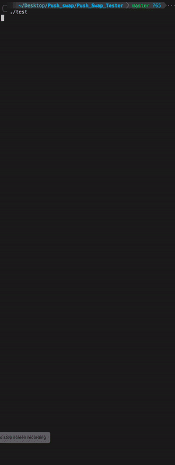
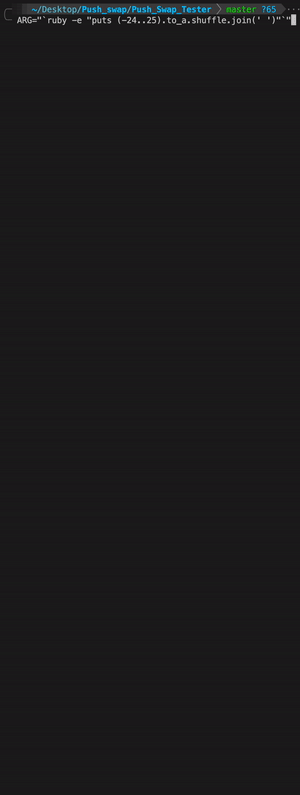

# Push_swap tester
With this tester, you get 2 executables.
  1. [tester](https://github.com/Miniflint/Push_Swap_Tester/README.md#Tester)
  2. [checker](https://github.com/Miniflint/Push_Swap_Tester/README.md#Checker)

The tester will `make` the project for you and automatically test it

It will display:
  1. Your average
  2. Notes
  3. `ok` and `ko`

It will also test your project to see if you handle all possible errors

# Download:
  1. Clone the repo in your push_swap directory `git clone https://github.com/tricaducee/Push_Swap_Tester.git`
  2. Go in it `cd Push_Swap_Tester`
  4. Launch [the tester](https://github.com/Miniflint/Push_Swap_Tester/README.md#Tester) or [the checker](https://github.com/Miniflint/Push_Swap_Tester/README.md#Checker)

# Tester

The file is named : `test`
  1. Run it with `./test`
  2. admire the result

Some of the result may go through even if it's not `[ok]`

For exemple when you return nothing instead of Error (with a newline)

# Checker:

If the executable isn't present, `make`

Run the checker like this: `../push_swap $ARG | ./checker $ARG`

If you want to add [flags](https://github.com/Miniflint/Push_Swap_Tester/README.md#flags)

### FLAGS:
Descriptions of flags:
  1. `-m` or `-min`: Display small `ok` and `ko` instead of ascii art
  2. `-p` or `-percent`: Affiche % of work completed, may not work on everyone's project
  3. `-c` or `-cmds`: Display the amount of command
  4. `-s` or `-stacks`: Display stack in real time the terminal

These commands can be done at the same time, such as: `-scp` or `-pms`

  5. `-l={VALUE}` or `-len={VALUE}`: Limit the lenght of the stack shown on screen (`-l=5` will show 5 first number of the stack)
  6. `-t={VALUE}` or `-time={VALUE}`: Little timer between every command. useful for debugging purposes
  7. `-f` or `-full`: is equal to `-s -c -p` at the same time
